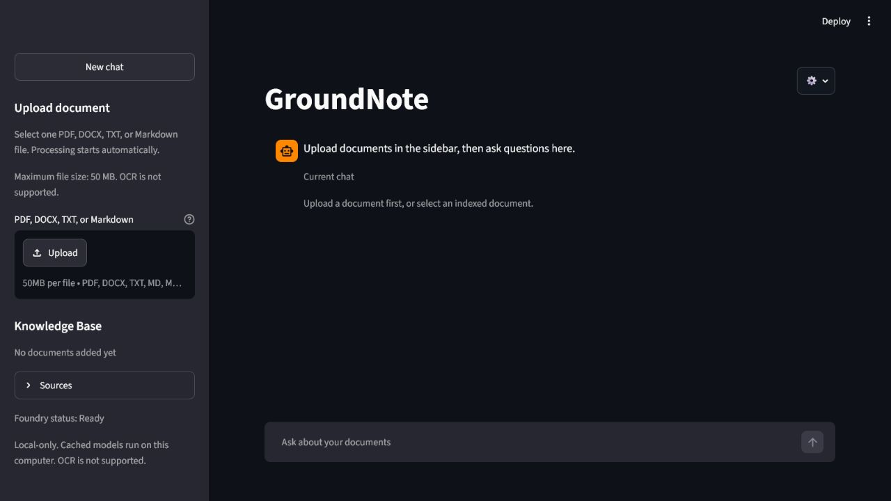
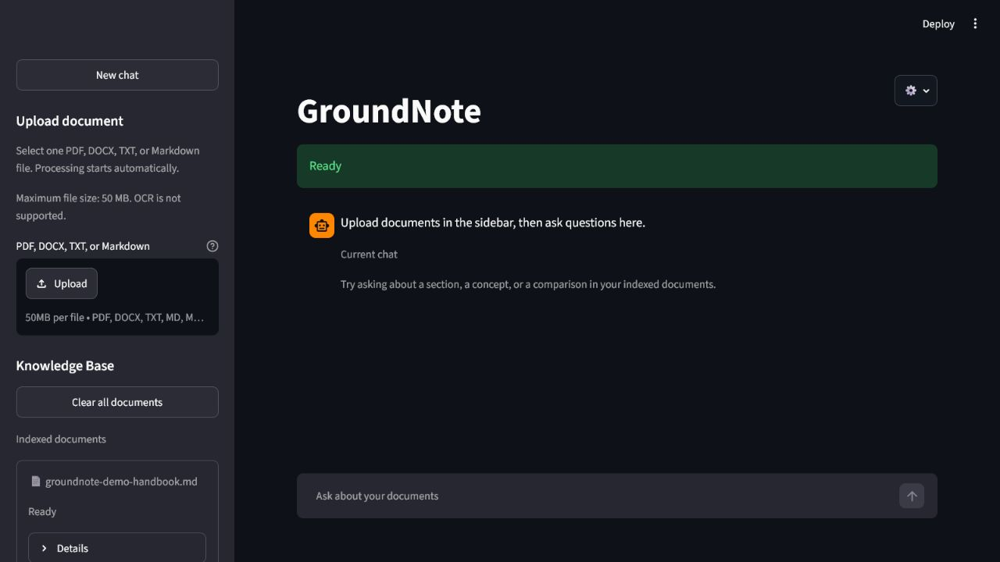
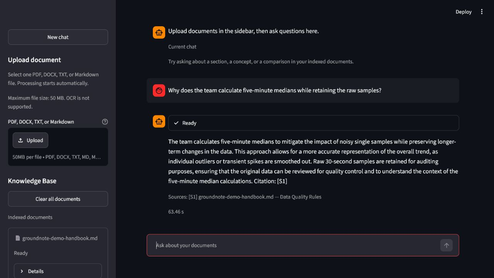

# GroundNote

**A private, offline-first RAG study assistant powered by Microsoft Foundry Local.**

GroundNote 1.0.0 turns local PDF, DOCX, TXT, and Markdown documents into a searchable study
knowledge base. It extracts and chunks text locally, stores float32 embeddings in SQLite, combines
lexical and vector retrieval, and asks a local language model to answer with validated source
citations.

## Project Status

Version **1.0.0** is the completed portfolio release. It is a local desktop-style application,
validated primarily on Windows 11. It is not presented as production-grade software and does not
include a signed native installer.

## Key Capabilities

- One-file-at-a-time local ingestion for PDF, DOCX, TXT, and Markdown.
- SHA-256 duplicate detection and application-managed document copies.
- Deterministic recursive chunking with page and section metadata.
- Microsoft Foundry Local embeddings and chat—no cloud inference fallback.
- SQLite FTS5 plus NumPy cosine similarity for hybrid retrieval.
- Grounded English and Turkish answers with validated citations.
- A Streamlit chat interface and local Knowledge Base controls.
- Re-index, remove, clear-all, source filters, New chat, and performance modes.
- Bounded PDF/DOCX processing and privacy-safe diagnostics, logs, and release tooling.

## Why GroundNote

Study documents often contain private notes, unpublished coursework, or personal annotations.
GroundNote demonstrates that a useful retrieval-augmented generation workflow can run on one
computer without sending documents, questions, embeddings, or answers to a cloud AI service. The
project deliberately uses readable Python, SQLite, NumPy, and small provider interfaces instead of
an external RAG framework or vector database.

## Screenshots

| Chat and upload | Knowledge Base |
| --- | --- |
|  |  |



The screenshots use only the original fictional handbook in
[`examples/groundnote-demo-handbook.md`](examples/groundnote-demo-handbook.md).

## How It Works

1. The user selects one supported document.
2. GroundNote validates its name, signature, size, and format-specific safety limits.
3. Text is extracted locally and split into metadata-preserving chunks.
4. Foundry Local produces embeddings in bounded batches.
5. SQLite stores metadata, chunks, FTS rows, and float32 embedding BLOBs.
6. A question is embedded and ranked with local lexical and vector retrieval.
7. Selected chunks are placed in a bounded prompt as untrusted evidence.
8. A Foundry Local chat model answers in the question language.
9. GroundNote validates citation IDs and renders sources from trusted metadata.

See [Architecture](docs/architecture.md) for the implemented component, indexing, RAG, model
lifecycle, and refresh-ownership diagrams.

## Architecture

```text
Streamlit UI
    -> UI workflows and application context
    -> document validation/parsing -> chunking -> indexing
    -> SQLite metadata + FTS5 + float32 embeddings
    -> hybrid retrieval -> bounded RAG prompt -> Foundry Local chat
    -> validated answer + trusted citations
```

Foundry-specific SDK behavior is isolated behind chat and embedding provider contracts. SQLite
transactions protect document state changes, while slow local model inference runs outside write
transactions. A document is Ready only after chunks, compatible embeddings, model metadata, and
FTS rows pass the final integrity check.

## Requirements

- Windows 11 is the primary validated platform.
- Python 3.11, managed by [uv](https://docs.astral.sh/uv/).
- Microsoft Foundry Local CLI.
- Enough disk space for the selected local models; models are not bundled.
- Internet for the initial dependency and model downloads.

The current verified development environment used Foundry Local CLI `0.10.2`,
`foundry-local-sdk-winml` `1.2.3`, Python `3.11.15`, and uv `0.11.29`. Foundry Local is preview
software, so its commands and catalog aliases may change.

## Quick Start on Windows

Install prerequisites:

```powershell
winget install --id=astral-sh.uv -e
winget install Microsoft.FoundryLocal
```

From the repository or extracted release directory:

```powershell
powershell -ExecutionPolicy Bypass -File scripts/setup_windows.ps1
powershell -ExecutionPolicy Bypass -File scripts/start_groundnote.ps1
```

Stop the scoped GroundNote session:

```powershell
powershell -ExecutionPolicy Bypass -File scripts/stop_groundnote.ps1
```

The launcher binds only to `127.0.0.1`, starts Foundry when needed, checks HTTP health, avoids
duplicate GroundNote sessions, and records token-scoped metadata for safe shutdown. It does not
download models automatically. Run the doctor if setup or startup reports a problem:

```powershell
powershell -ExecutionPolicy Bypass -File scripts/doctor.ps1
```

For development:

```powershell
uv sync
uv run streamlit run src/groundnote/app.py
```

## Foundry Local Setup

Check the installed runtime and catalog:

```powershell
foundry --version
foundry server status
foundry status
uv run python scripts/check_foundry.py
```

If the installed service is stopped:

```powershell
foundry server start
```

The configured model aliases are:

- Default chat: `phi-3.5-mini`
- Low-resource chat: `qwen2.5-0.5b`
- Embeddings: `qwen3-embedding-0.6b`

Download a missing model only through an explicit Foundry command. GroundNote never silently uses a
cloud provider or downloads a model merely to render the UI. See
[Foundry Local setup](docs/foundry-local-setup.md) for Windows and macOS notes.

## Supported Documents

| Type | Extensions | Preserved location metadata | Important limitation |
| --- | --- | --- | --- |
| PDF | `.pdf` | 1-based page number | No OCR; encrypted and image-only PDFs are rejected |
| DOCX | `.docx` | Heading/section | Page numbers require layout rendering and are unavailable |
| Text | `.txt` | Chunk order | UTF-8 and UTF-8 with BOM only |
| Markdown | `.md`, `.markdown` | Heading/section | Embedded content is inert and is not fetched |

GroundNote accepts one file at a time and processes it synchronously. The default compressed upload
limit is 50 MB. See [Supported documents](docs/supported-documents.md) for the complete contract.

## Usage

1. Select a file in the sidebar. Indexing starts automatically.
2. Wait until the document becomes **Ready**. Chat is disabled while indexing is active.
3. Ask a factual, comparison, or summary question in English or Turkish.
4. Check the compact sources below the answer.
5. Use Knowledge Base controls to re-index or remove a document.
6. Use **New chat** to clear only the in-memory conversation; indexed documents remain.

For a repeatable demonstration, use [Demo questions](examples/demo-questions.md) and the
[3–5 minute demo script](docs/demo-script.md).

## Privacy and Offline Behavior

- Documents, managed copies, SQLite data, embeddings, prompts, answers, and logs stay on the local
  machine.
- No Azure OpenAI, OpenAI API, telemetry, analytics, cloud sync, or remote fallback is used.
- Initial dependency and model downloads require internet. Cached model inference is intended to
  work offline.
- Retrieved document text is treated as untrusted evidence, never as an instruction.
- Logs exclude full document text, full questions, prompts, vectors, raw paths, and secrets.
- The release archive excludes local databases, documents, logs, models, caches, `.env`, and test
  artifacts.

Local models can still be wrong. Verify high-stakes answers against the displayed source document.

## Document Safety Limits

Conservative release defaults are applied before local embedding:

- 50 MB compressed upload size
- 1,000 PDF pages
- 5,000,000 extracted characters
- 10,000 generated chunks
- 200 MB total declared DOCX expansion
- 50 MB per DOCX archive member
- 100:1 DOCX compression ratio
- 2,000 DOCX archive members

DOCX packages are inspected as untrusted ZIP archives. Unsafe paths, duplicate/encrypted/special
entries, unsafe XML declarations, and excessive expansion are rejected without extracting archive
members to disk. Raising these limits increases CPU, memory, and indexing-time risk.

## Performance Notes

Measured results depend on hardware, model variants, document structure, and cache state. Current
Foundry catalog variants on the validated Windows machine selected CPU execution providers.

| Workload | Observed result |
| --- | ---: |
| `phi-3.5-mini` short benchmark response | 0.505 s after a 5.85 s load |
| `qwen2.5-0.5b` short benchmark response | 0.135 s after a 2.64 s load |
| `qwen3-embedding-0.6b` small benchmark batch | 1.58 s after a 2.43 s load |
| 121-chunk real indexing benchmark | 83.833 s total; 82.300 s embedding |

CPU embedding is currently the main indexing bottleneck. Indexing is synchronous, one document is
uploaded at a time, and chat remains unavailable during indexing to avoid unsafe model overlap. See
[Model benchmark](docs/model-benchmark.md) and
[Model lifecycle and indexing performance](docs/model-lifecycle-performance.md) for context; these
numbers are measurements, not performance guarantees.

## Testing

```powershell
uv sync
uv run ruff check .
uv run ruff format --check .
uv run mypy src
uv run pytest -m "not foundry"
uv run pytest --cov=groundnote --cov-report=term-missing
uv run python scripts/smoke_ui_pipeline.py
```

Real Foundry validation is intentionally separate because it uses cached local models:

```powershell
uv run python scripts/check_foundry.py
uv run python scripts/smoke_ui_real.py
```

Unit tests use fake providers and do not require model downloads. Release validation also covers
PowerShell parsing, runtime-only setup, idempotency, scoped start/stop, deterministic archives,
SHA-256 verification, extraction into a path containing spaces, and extracted-release startup.

## Project Structure

```text
src/groundnote/
  ai/           Foundry-neutral contracts and local provider adapters
  documents/    validation, managed files, and parsers
  chunking/     deterministic recursive chunking
  embeddings/   float32 validation and batching
  storage/      SQLite migrations, repositories, and Unit of Work
  retrieval/    FTS5, vector scoring, and hybrid ranking
  rag/          context, prompts, generation, and citation validation
  services/     ingestion, indexing, integrity, and ownership
  ui/           Streamlit state, components, and workflows
scripts/        setup, doctor, launcher, smoke, benchmark, and release tools
tests/          unit and integration tests
docs/           architecture, setup, safety, release, and demo documentation
examples/       original redistribution-safe demonstration material
```

## Release Archive

Build the deterministic portable source archive:

```powershell
powershell -ExecutionPolicy Bypass -File scripts/build_release_archive.ps1
```

This creates `dist/groundnote-1.0.0.zip` and `dist/groundnote-1.0.0.zip.sha256`. Verify the
sidecar before extraction:

```powershell
$expected = (Get-Content dist/groundnote-1.0.0.zip.sha256).Split()[0]
$actual = (Get-FileHash dist/groundnote-1.0.0.zip -Algorithm SHA256).Hash.ToLowerInvariant()
if ($actual -ne $expected) { throw "Checksum mismatch" }
```

Generated ZIP and checksum files are release outputs and are intentionally ignored by Git.

## Known Limitations

- CPU embedding latency can be substantial for medium or large documents.
- Indexing is synchronous; there is no persistent background queue or cancellation service.
- Only one file can be uploaded at a time, and chat is unavailable during indexing.
- No OCR, image, audio, video, or cloud-source ingestion.
- No persistent conversation history or multi-user accounts.
- A failed re-index does not preserve the previous complete vector version.
- No native signed installer, automatic updater, or bundled models.
- Launcher and portable-release validation are Windows-focused; macOS compatibility is best effort.
- Foundry Local is preview software and its SDK/catalog may change.

## Roadmap

The 1.0.0 portfolio scope is complete. Potential future enhancements include OCR, cancellable
background indexing with durable ownership, improved acceleration support, old-vector preservation
during re-index, broader macOS validation, and a signed native installer. These are future ideas,
not current features. See [Roadmap](ROADMAP.md).

## Contributing

Contributions should preserve the offline/privacy boundary, provider isolation, safe fixtures, and
single-process resource controls. Read [CONTRIBUTING.md](CONTRIBUTING.md) before opening a pull
request.

## Security

Please use the private reporting guidance in [SECURITY.md](SECURITY.md). Never attach private
documents, local databases, logs, prompts, or screenshots containing personal information to a
public issue.

## License

GroundNote is available under the [MIT License](LICENSE).

## Acknowledgements

- [Microsoft Foundry Local](https://learn.microsoft.com/azure/ai-foundry/foundry-local/)
- [Streamlit](https://streamlit.io/)
- [uv](https://docs.astral.sh/uv/)
- The open-source Python, SQLite, NumPy, pypdf, and python-docx communities
