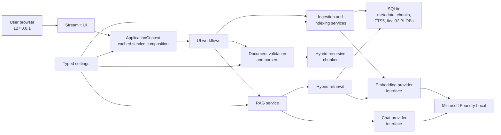
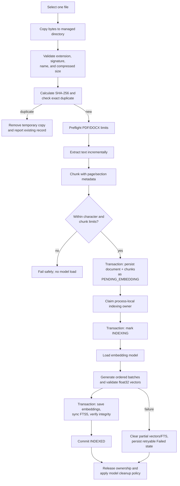
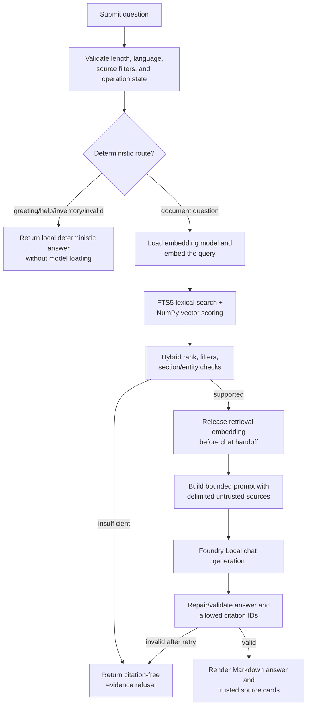
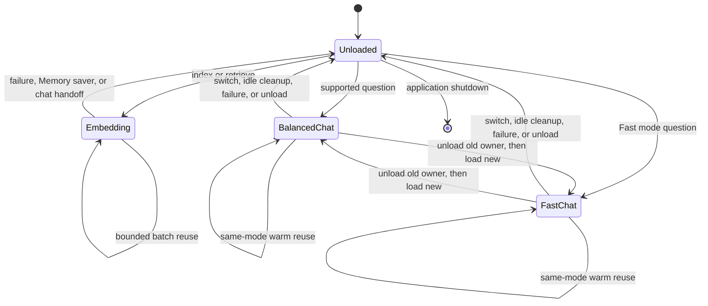
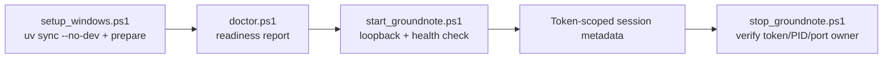

# GroundNote Architecture

GroundNote 1.0.0 is a single-user, local Streamlit application. Its design keeps document content
and model inference on the user's computer, isolates the preview Foundry Local SDK, and makes index
integrity explicit. This document describes the implemented system rather than a proposed redesign.

## High-Level Components



`build_application_context()` constructs long-lived service objects but does not load a model.
SQLite connections and Units of Work are short-lived. Uploaded bytes, extracted text, prompts,
vectors, and database transactions are not stored in Streamlit's cached resource.

## Main Boundaries

| Area | Responsibility |
| --- | --- |
| `config` | Typed defaults, `.env`/environment loading, path resolution, and resource limits |
| `documents` | Filename/signature validation, SHA-256, managed copies, and bounded parsers |
| `chunking` | Deterministic paragraph/sentence/whitespace splitting and source metadata |
| `storage` | Migrations, parameterized SQLite repositories, FTS5, and Unit of Work |
| `embeddings` | Provider-neutral batching and finite normalized float32 validation |
| `retrieval` | Local FTS5 candidates, NumPy cosine scoring, filtering, and hybrid ranking |
| `rag` | Query routing, bounded context, prompt safety, generation, and citation validation |
| `services` | Pre-embedding ingestion, index integrity, indexing, and active ownership |
| `ui` | Streamlit rendering, safe session state, localization, and workflow adapters |
| `ai` | Foundry Local manager, provider interfaces/adapters, lifecycle, and fakes |

## Document Indexing Pipeline

Only one document is selected and indexed at a time. The browser file type is not trusted. Slow
model work happens outside SQLite write transactions.



The managed copy is an application-owned source for re-indexing. GroundNote never deletes the
original file selected by the user. Remove and clear-all first commit database changes, then delete
only a validated normal direct child of the managed document directory.

### Format Safety

- PDF parsing is page-by-page with a page-count and cumulative-character limit.
- DOCX is inspected as an untrusted ZIP. It is never extracted to the filesystem; only bounded
  `word/document.xml` and optional `word/styles.xml` streams are read.
- TXT and Markdown accept UTF-8/UTF-8 BOM and reject binary-looking input.
- Parsed text is inert data. It is never executed, fetched, or treated as model instructions.

## Question-Answering Pipeline



The system prompt never incorporates source text as instructions. The context builder assigns
opaque source IDs such as `S1`; final filenames, pages, and sections come from trusted retrieval
metadata rather than model output. Unknown citation IDs are discarded.

## Retrieval and Persistence

SQLite holds:

- document metadata and safe original/stored names;
- ordered chunks with page, section, and source-order metadata;
- normalized finite `float32` embeddings as binary BLOBs;
- embedding model/version/dimension metadata;
- an FTS5 row for each searchable chunk; and
- schema/application metadata.

Semantic retrieval loads compatible vectors and uses NumPy dot product on normalized arrays as
cosine similarity. FTS5 provides lexical candidates; deterministic boosts account for headings,
filenames, numbered terms, and conservative typo expansion. Retrieval independently requires a
complete Ready index, even before the UI reconciles status.

## Model Lifecycle



GroundNote's process-local lifecycle permits at most one GroundNote-owned chat provider to remain
active. Already-loaded models that may belong to another application are not unloaded. Embedding
resources are released before chat generation, and chat is blocked during indexing; multiple chat
models and embedding/chat inference are not intentionally overlapped.

The direct SDK path may fall back to Foundry Local's OpenAI-compatible loopback daemon endpoint for
the same local model when preview SDK loading fails. The endpoint is restricted to loopback and is
not a cloud fallback.

## Refresh and F5 Indexing Ownership

Streamlit reruns and browser refreshes rebuild session state, but the Python process and cached
application context can remain alive. A database row alone cannot distinguish active work from a
crashed process, so GroundNote uses a database-scoped in-process registry.

```mermaid
sequenceDiagram
    participant U as Browser session A
    participant R as Process-local owner registry
    participant DB as SQLite
    participant F as Foundry Local
    participant V as Refreshed session B

    U->>R: Claim opaque pipeline/document token
    U->>DB: Commit INDEXING
    U->>F: Generate embedding batches
    U-->>V: Browser refresh / new Streamlit session
    V->>R: Check active owner
    R-->>V: Active
    V->>DB: Read non-searchable INDEXING state
    Note over V: Show Indexing; block chat, upload,<br/>remove, clear-all, and re-index
    F-->>U: Embeddings complete
    U->>DB: Save vectors + FTS, verify, commit INDEXED
    U->>R: Release owner
    V->>R: Check owner
    R-->>V: Inactive
    V->>DB: Verify complete index
    Note over V: Show Ready and permit retrieval
```

If the whole GroundNote process exits, the registry disappears. At the next bootstrap, persisted
transient states have no active owner and are reconciled to a non-searchable, retryable Interrupted
state with partial vectors and FTS rows cleared. If a local inference call hangs without returning,
the UI remains conservatively blocked until a server restart triggers this recovery.

## Index Integrity

Ready means all of these are true in committed storage:

1. the document has at least one chunk;
2. every chunk has a finite compatible float32 embedding;
3. document and chunk model/version/dimension metadata match active settings;
4. every chunk has exactly one valid FTS row; and
5. no process-local indexing owner remains active.

Final indexing checks the contract in the committing transaction. Bootstrap and read paths also
reconcile or exclude incomplete indexes, so a refresh cannot turn partial work into Ready.

## UI State and Privacy

Streamlit session state contains only message display models, source-filter IDs, opaque operation
identifiers, timestamps, upload widget revision, performance/language settings, and a one-time safe
notice. It does not retain uploaded bytes, extracted content, embeddings, prompts, provider model
objects, SQLite connections, or transactions. Chat history is session-only and New chat does not
delete the Knowledge Base.

Logs record event categories, safe counts, statuses, model aliases, and durations. Redaction and
safe error mapping keep document text, full questions, prompts, vectors, raw exception bodies,
secrets, and absolute paths out of shareable output and the browser.

## Setup, Doctor, Launcher, and Stop



Setup is idempotent and does not download models. A stopped but installed Foundry service is a
warning because the launcher owns startup. The launcher checks readiness, binds Streamlit to
loopback, writes session metadata atomically, and cleans only token-owned processes after failure.
The stop script never broadly terminates Python. Foundry remains running unless the user explicitly
requests `-StopFoundry`, because another local application may share it.

## Portable Release Process

`scripts/build_release_archive.ps1` calls the deterministic Python archive builder through the
runtime-only environment. The builder:

1. walks explicit root files and allowed source/documentation directories;
2. rejects symlink/reparse-point and repository-boundary violations;
3. excludes databases, documents, logs, models, caches, tests, secrets, and all ZIP/checksum input;
4. sorts archive members and assigns a fixed timestamp;
5. creates `groundnote-1.0.0.zip`; and
6. writes a filename-only SHA-256 sidecar.

The archive is validated by building twice, comparing bytes/checksums, inspecting every member,
extracting into a path containing spaces, running runtime-only setup and doctor, starting the
loopback UI, checking HTTP health, and performing scoped stop. Generated release artifacts are not
tracked in Git.

## Deliberate Constraints

GroundNote has no OCR, external vector database, cloud inference, telemetry, background worker,
durable upload queue, persistent chat history, multi-user layer, native installer, or automatic
updater. These constraints keep the 1.0.0 portfolio application understandable and make its local
privacy boundary explicit.
