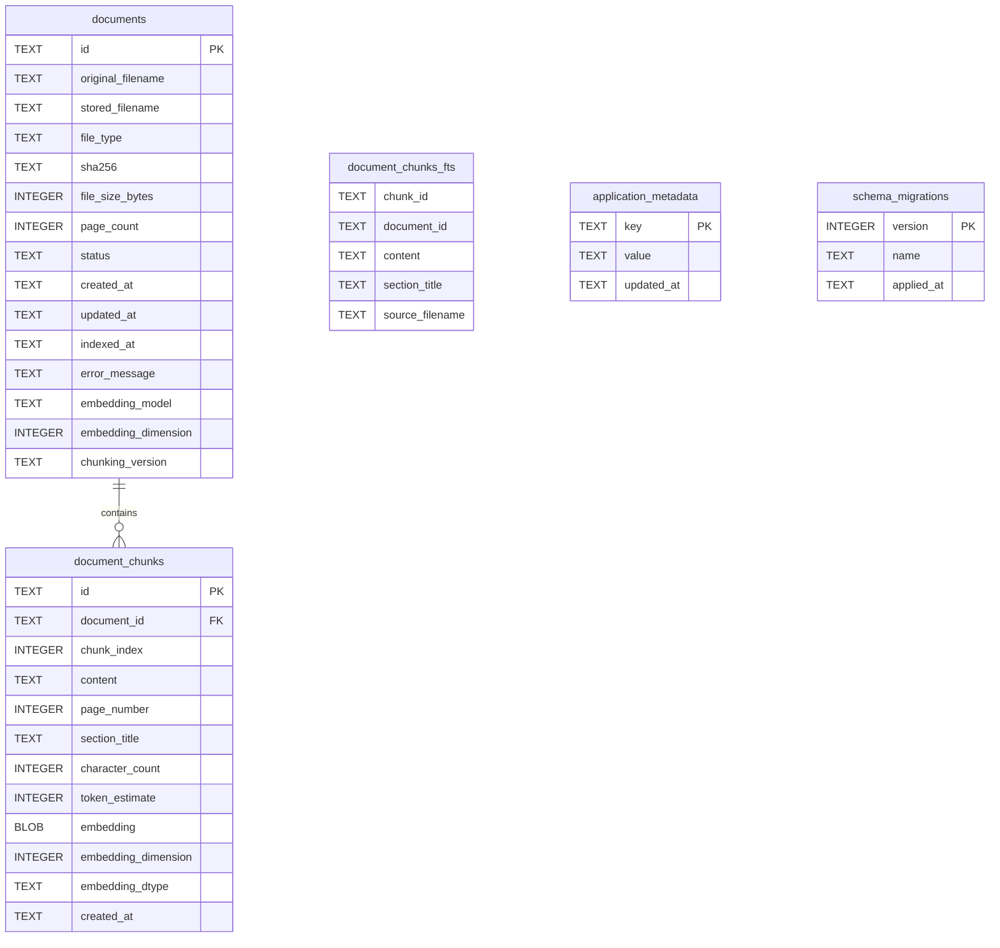

# GroundNote Database Schema

GroundNote uses SQLite through Python's standard `sqlite3` module. The database is initialized
only through explicit bootstrap or migration calls.

## Tables

`documents` stores one row per user document. It records filenames, file type, SHA-256 duplicate
detection data, indexing status, timestamps, and future embedding/chunking metadata.

`document_chunks` stores text chunks for future indexing. Embeddings are stored as compact BLOB
values and linked to documents with `ON DELETE CASCADE`.

`document_chunks_fts` is a SQLite FTS5 virtual table used for local lexical retrieval over chunk
content, section titles, and source filenames.

`application_metadata` stores simple key-value application metadata.

`schema_migrations` records applied migration versions.

## Indexes

- `idx_documents_sha256`: duplicate lookup.
- `idx_documents_status`: status filtering.
- `idx_documents_indexed_at`: indexed document ordering/filtering.
- `idx_document_chunks_document_id`: chunk lookup by document.

## Embedding Storage

Embeddings are serialized as one-dimensional contiguous `float32` arrays using `numpy.tobytes()`.
The database stores the BLOB, dimension, and dtype name. Pickle and JSON embedding storage are not
used.

## Transactions

SQLite connections enable foreign keys and a busy timeout. The Unit of Work opens one connection,
begins a transaction, exposes document and vector repositories, and commits only when explicitly
requested. Exiting without commit rolls back.

## Migration Behavior

Migration files live in `src/groundnote/storage/migrations`. The runner discovers versions in
order, applies unapplied migrations transactionally, records successful versions, and is safe to
run repeatedly.

## Current Limitations

GroundNote uses SQLite FTS5 for lexical retrieval when available. It does not use a remote search
service, external vector database, or cloud-hosted retrieval system.
